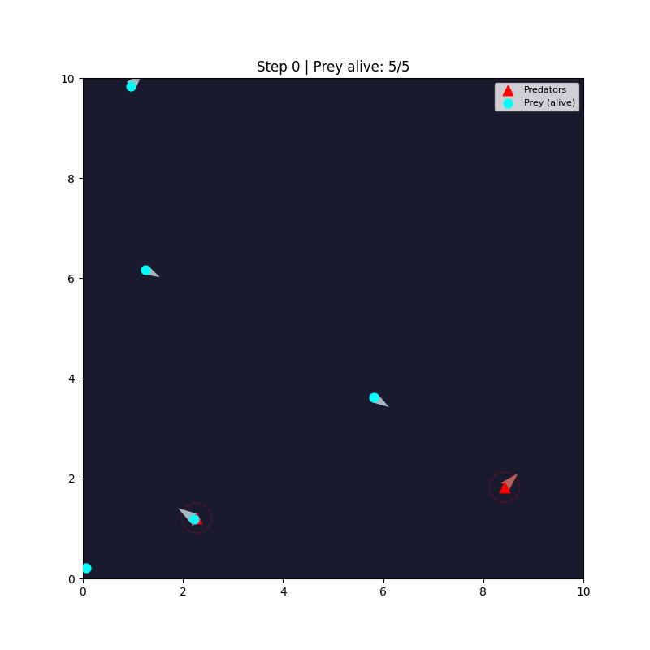

# rl-tidbits

Reinforcement learning experiments in JAX.

## Predator-Prey with IPPO

Multi-agent predator-prey environment trained with Independent PPO (IPPO). Two predators with shared network weights learn to hunt five independently-learning prey on a 10x10 toroidal grid. Everything is JAX — environment, PPO, training loop — compiled into a single `jax.lax.scan` with no CPU-GPU sync during training.



*2 predators (red) vs 5 prey (blue), both sides learning via IPPO. Captured prey shown as grey X marks.*

### Running

```bash
uv sync

# Train with IPPO (both sides learn)
uv run python -m jax_boids.train --mode train --config best_pred2 --prey-learn

# Hyperparameter sweep
uv run python -m jax_boids.train --mode sweep --n-configs 100 --total-timesteps 1000000

# Visualize a trained checkpoint
uv run python -m jax_boids.visualize_trained runs/<run_dir>
```

### Structure

```
jax_boids/
  envs/           # Predator-prey environment (pure JAX)
  ppo.py          # PPO implementation
  networks.py     # Actor-critic MLP
  collector.py    # Rollout collection
  train.py        # Unified entrypoint (train, sweep, validate)
  train_ippo.py   # IPPO training (both sides learn)
  train_single.py # Single-agent training (one side learns)
  configs.py      # Named hyperparameter configs
```

## Past experiments

- **Humanoid-v5** — SAC with stable-baselines3 and Gymnasium (code removed, in git history)
